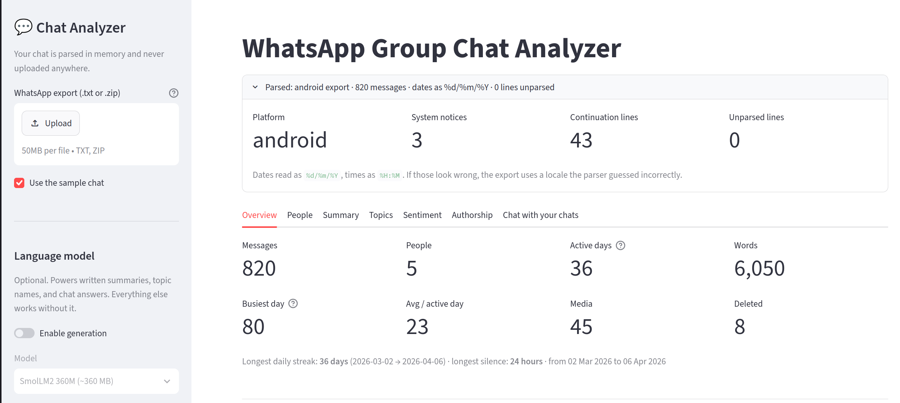

<div align=center>

# WhatsApp Group Chat Analyzer

[](https://github.com/henryhale/whatsapp-analyzer/commits)
[](https://streamlit.io/)
[](https://scikit-learn.org/)
[](https://onnxruntime.ai/)

[](https://whatsapp-analyzer-f6ppmgg6eypypgixnnczjk.streamlit.app/)

<br>
<br>
</div>


Explore a WhatsApp group export with local statistics, topic and sentiment
analysis, authorship detection, summaries, and grounded chat search.

- Parses Android and iPhone `.txt` or `.zip` exports.
- Processes chat exports in memory without saving them.
- Works without PyTorch or a language model.
- Includes a synthetic sample chat for a quick demo.

## Run online

Launch live demo: [https://whatsapp-analyzer-f6ppmgg6eypypgixnnczjk.streamlit.app/](https://whatsapp-analyzer-f6ppmgg6eypypgixnnczjk.streamlit.app/) 🚀

## Run locally

```bash
python -m venv .venv
source .venv/bin/activate
pip install -r requirements.txt
streamlit run app.py
```

The app opens with the bundled sample. To analyze your own chat, export it from
WhatsApp using **More → Export chat → Without media**, then upload the file.

## Features

- **Overview:** activity, participation, streaks, silences, and trends
- **People:** reply times, conversation starters, top words, and emoji
- **Summary:** extractive highlights and optional generated summaries
- **Topics:** NMF topics from conversation blocks
- **Sentiment:** a classifier trained from emoji-labelled messages
- **Authorship:** writing-style classification using character n-grams
- **Chat search:** answers grounded in retrieved conversation windows, with sources

## Train the models

The app works without trained models. Train them on the sample or replace the
path with your own export:

```bash
python train/train_sentiment.py --chat data/sample_chat.txt
python train/train_author_id.py --chat data/sample_chat.txt
python train/train_topics.py --chat data/sample_chat.txt --k 8
```

Each script reports held-out accuracy and a baseline.

## Optional local LLM

Generation is off by default. Enable it in the sidebar for written summaries,
topic names, and chat answers. The app uses ONNX Runtime with
`SmolLM2-360M-Instruct`, falls back to a 135M model, then to retrieval-only
search. Model weights download on first use and are cached locally.

## Privacy

Chat exports may contain private messages and phone numbers. Files are parsed
in memory, and `data/.gitignore` prevents local exports from being committed.
Use care when deploying the app publicly.

## Project structure

```text
app.py                  Streamlit interface
src/parser.py           WhatsApp export parser
src/stats.py            Descriptive statistics
src/summarize.py        Extractive and generated summaries
src/rag.py              Retrieval and grounded prompts
src/llm.py              ONNX language-model fallback chain
src/models.py           Trained artifact loading
src/viz.py              Plotly charts
train/                  Model training scripts
data/sample_chat.txt    Synthetic demo chat
```
